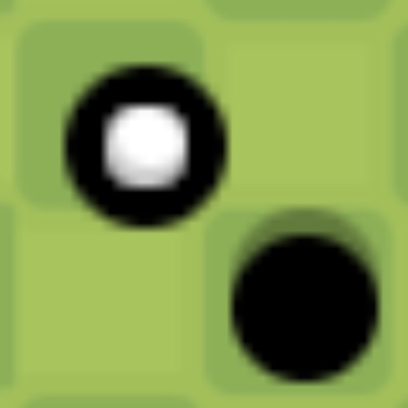

# Mini Golf Game    

This Mini Golf Game is a simple implementation using [raymob](https://github.com/Bigfoot71/raymob), another implementation of [raylib](https://www.raylib.com/) for Android.

## Prerequisites

**You will need SDK API 34 and NDK r23 (or higher, compatible with CMake 3.22.1).**

If you already have this version of SDK and NDK without having Android Studio, you should still be able to compile the project using `gradlew.bat` for Windows or `gradlew` for Linux or MacOS.

## How to Install?

1. Open the `app/build/outputs/apk` directory and navigate to the app-debug.apk
2. That's it! Install and test

**Note**: If you're building, there are errors. They seem fairly harmless so I didn't give a shit and built 'em in. Please do not follow what I did. LOL.

## Contributions

If you would like to help contribute, whether in some small way - please help i am out of ideas
shoot me a DM at Discord @deleted_user_5530421a393b(yes my user is this i havent changed it yet lol it will be changed in a while)
